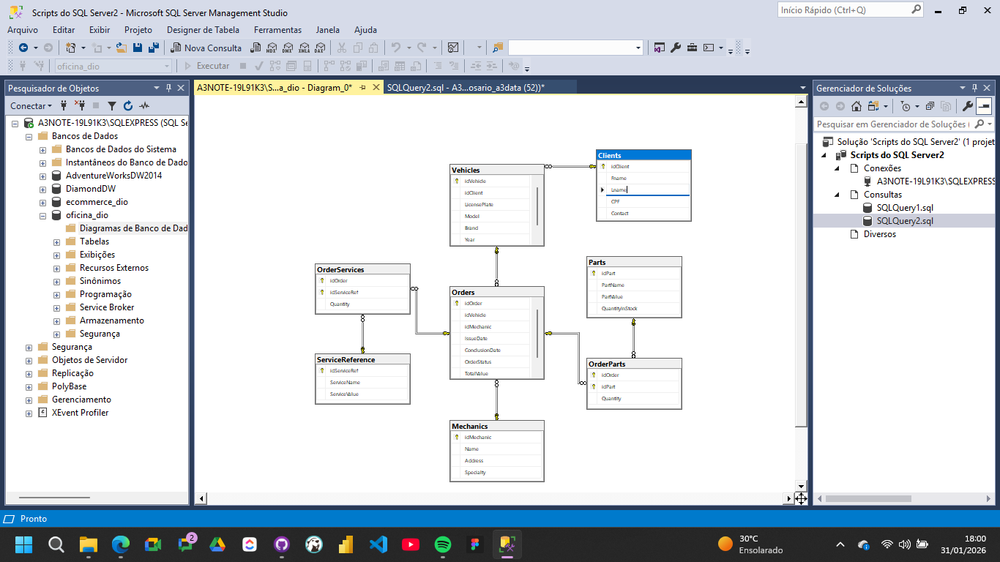

# 🔧 Sistema de Gerenciamento de Oficina Mecânica (SQL)

Este repositório contém a resolução do desafio de projeto **"Construindo um Esquema Conceitual para Banco de Dados"** do Bootcamp de Ciência de Dados da DIO.

O projeto modela um sistema de controle para oficina mecânica, gerenciando desde o cadastro de veículos e clientes até a execução de Ordens de Serviço (OS) com controle de peças e mão de obra.

## 🛠️ Tecnologias
* **SQL Server (T-SQL)**
* **SQL Server Management Studio (SSMS)**
* **Git/GitHub**

## 📋 Destaques da Modelagem
O esquema relacional foi refinado para atender a regras de negócio complexas:
1.  **Ordem de Serviço (OS):** Entidade central que une Clientes, Veículos e Mecânicos responsáveis.
2.  **Relacionamentos N:M:** Implementação de tabelas associativas (`OrderParts` e `OrderServices`) permitindo que uma única OS contenha múltiplas peças e múltiplos serviços simultaneamente.
3.  **Controle de Estoque:** A tabela de Peças (`Parts`) foi projetada para suportar controle de inventário futuro.

## 🧠 Queries Analíticas (DQL)
Além do CRUD básico, foram desenvolvidas queries estratégicas para a gestão da oficina:

### 1. Cálculo Automático de Custos
Uso de atributos derivados para calcular o valor total de peças utilizadas em cada serviço.
```sql
SUM(p.PartValue * op.Quantity) AS CustoTotalPecas
```

### 2. Performance da Equipe
Filtro com HAVING para identificar mecânicos com alta demanda de serviços.
```sql
HAVING COUNT(o.idOrder) >= 1
```
### 3. Relatório Gerencial
Uso de `INNER JOIN` conectando 4 tabelas para entregar um relatório completo (Cliente + Veículo + Mecânico + Status).

## 📸 Diagrama EER


## 📂 Como Executar
1. Clone o repositório.
2. Abra o arquivo `script_oficina.sql` no SSMS.
3. Execute todo o script (F5) para criar o banco e inserir os dados de teste.
4. Verifique os resultados na aba de mensagens.

---
**Karla Renata**
[LinkedIn](https://www.linkedin.com/in/karlareanata-rosario)
Uso de atributos derivados para calcular o valor total de peças utilizadas em cada serviço.
```sql
SUM(p.PartValue * op.Quantity) AS CustoTotalPecas
